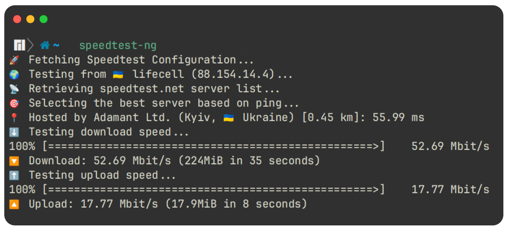

<div align="center">

<h1>speedtest-ng</h1>
<h3>
A command-line tool for testing internet speed using Speedtest.net.
</h3>

[](https://github.com/mamantoha/speedtest-ng/actions/workflows/crystal.yml)
[](https://github.com/mamantoha/speedtest-ng/releases)
[](https://snapcraft.io/speedtest-ng)
[](https://github.com/mamantoha/speedtest-ng/blob/master/LICENSE)
</div>

## Installation

[](https://snapcraft.io/speedtest-ng)

Precompiled executables are available for Linux, macOS and Windows from [Releases](https://github.com/mamantoha/speedtest-ng/releases) page.

### Build from source

Clone the repository:

```sh
git clone https://github.com/mamantoha/speedtest-ng
cd speedtest-ng
```

Build the project:

```sh
shards build --release
```

## Usage

```sh
speedtest-ng --help
Usage: speedtest-ng [options]
    --no-download                    Do not perform download test
    --no-upload                      Do not perform upload test
    --single                         Only use a single connection (simulates file transfer)
    --list                           Display a list of speedtest.net servers sorted by distance
    --server SERVER                  Specify a server ID to test against
    --secure                         Use HTTPS instead of HTTP when communicating with speedtest.net operated servers
    --download-time SECONDS          Set download test time limit in seconds (default: 20)
    --upload-time SECONDS            Set upload test time limit in seconds (default: 20)
    -v, --version                    Show the version number and exit
    -h, --help                       Show this help message and exit
```



## Contributing

1. Fork it (<https://github.com/mamantoha/speedtest-ng/fork>)
2. Create your feature branch (`git checkout -b my-new-feature`)
3. Commit your changes (`git commit -am 'Add some feature'`)
4. Push to the branch (`git push origin my-new-feature`)
5. Create a new Pull Request

## Contributors

- [Anton Maminov](https://github.com/mamantoha) - creator and maintainer
